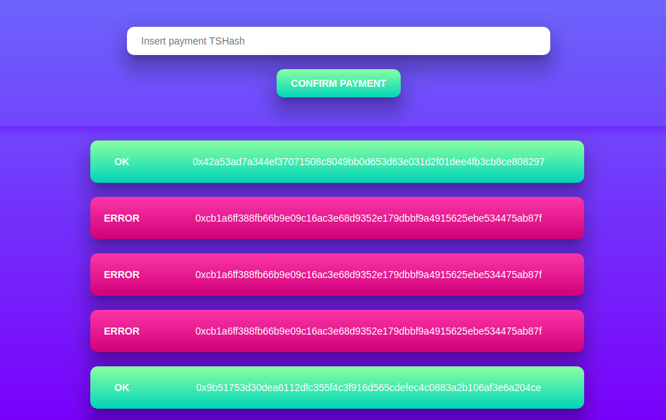

# Payment Gateway

This APP simulates the sending of a ETH transaction hash (TXHash) as payment, and confirms it against Etherscan API.



### Tech stack

- Elixir;
- Phoenix Framework;
- PostgreSQL;
- NPM;
- Webpack;
- ReactJS and Redux; and
- Sass

### Installation

Assuming that you already have the technologies above pre-installed, clone the repository and install dependencies.

```bash
# Clone this repository
$ git clone https://douglasxgabriel@bitbucket.org/douglasxgabriel/payment_gateway.git

# Go into the repository
$ cd payment_gateway

# Install project dependencies
$ mix deps.get

# Go into UI app
$ cd apps/ui

# Install npm dependencies
$ npm install
```

Also, you may want to configure your local database. To do this you must go into the following files and update the data.

- apps/core/config/config.exs
- apps/core/config/dev.exs
- apps/core/config/test.exs
- apps/payment_checker/config/test.exs

### Tests

It's possible to run tests from the root dir, this way it will run tests for all the umbrella apps.

```bash
# in payment_gateway root
$ mix test
```
Or it's also possible to run tests for a specific app.

```bash
# Go into app directory
$ cd apps/<app>

$ mix test
```

### Usage

To run the APP you can go into UI app and run phoenix.server

```bash
# Go into UI app
$ cd apps/ui

# Run Phoenix Server
$ mix phoenix.server
```

This way it will also run `webpack-cli` command that watches file changes inside `payment_gateway/apps/ui/web/static`. But you can also run the app from root directory and start webpack by yourself.

```bash
# In payment_gateway root

# Run Phoenix Server
$ mix phoenix.server

# Run webpack-cli
$ webpack-cli --config webpack.config.js --watch --colors
```

Then your server should be running on `http://localhost:4000`

### Umbrella apps

This project contains four umbrella apps, each one with its own responsability:

#### Core
This project provides database configuration such as Migrations, Schemas and Repo, as well as Management modules to interact with entities.

> By centralizing database logic in this single project, other projects are allowed to use the shared routines to interact with database. It strategy provides a better code reusability and improves the maintenance.

#### EthereumService
This project provides modules to communicate with Etherscan API.

> Once that to interact with a API is a specialized task, where the consumer needs to know a lot about the provider, split this logic into a single app is a good strategy since it can provide a common interface to for the others that can ignore the particularities of the API.

#### PaymentChecker

This project contains a worker that is called constantly after a amount of time and uses the `Core` app to retrieve unconfirmed payments and uses `EthereumService` app to check if the payment was confirmed in Etherscan API.

> This project also abstracts a specialized task that can be abstracted from the other projects.

#### UI

This project provides ways to communicate with external users, both by a REST API or webpage.

> Here is abstracted another specialized taks that is to communicate with external users and put together all apps from the umbrella.

### Features

- Record a payment;
- List all recorded payments;
- Confirm a payment; Payment status could be:
  - Error;
  - OK;
  - Undefined; When has this status, a worker will verify again after a fixed amount of time;
